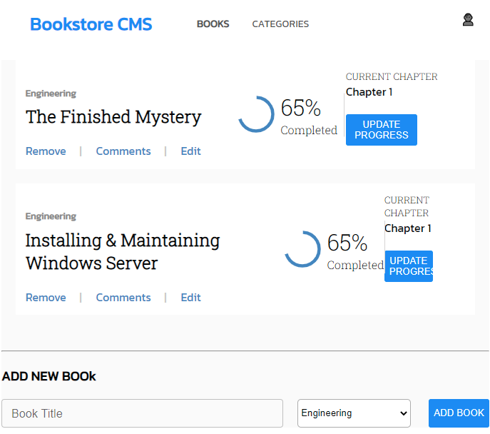

# Bookstore

This Bookstore is an app that allows you to display a list of books, add a book, remove a selected book from the list. It is built with React, HTML, CSS, JavaScript.

## Built With
- React.js
- HTML
- CSS
- Linters
- JavaScript

## Live Demo
[localhost:3000](https://localhost:3000)

## Getting Started
To get a local copy open and running follow these simple example steps.

### Setup
- Download or Clone Repository.
- In case you downloaded repository Extract ZIP Folder.

### Installation
- One folder in your text editor.
- Run `npm install` command to install all dependencies.
*N.B: Make sure that you have node installed in your commputer, if not [Download Node](https://nodejs.org/en/)*

### Usage
To use this project run `npm start` command in terminal of your editor project will start automatically after whille

## Author
## 👤 **Emmanuel Paul**

- GitHub: [Emmanuel Paul](https://github.com/Epaltechs/Bookstore)
- Twitter: [Emmanuel Paul](http://twitter.com/@emmapaul247)
- LinkedIn: [Emmanuel Paul](https://www.linkedin.com/in/emmanuel-paul-a2bab7b4/)

## :handshake: Contributing
Contributions, issues, and feature requests are welcome!
Feel free to check the [issues page](https://github.com/Epaltechs/Bookstore/issues).

## Show your support
Give a :star:️ if you like this project!

## Acknowledgments
- Many thanks to Microverse community and a hat tip to all those who have contributed to my progress.

## :memo: License
This project is [MIT](./MIT.md) licensed.
